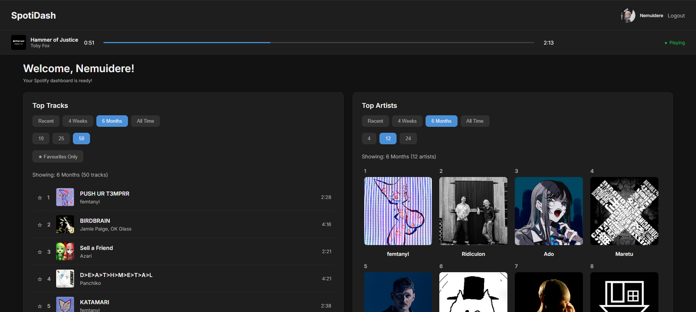

# SpotiDash

A clean personal Spotify analytics dashboard.\
Logs into your Spotify account and turns your listening data into a live web
dashboard — top tracks and artists, genre evolution, listening stats, a playlist
overview and a real-time "now playing" bar.
 
Built with Dash + Flask and the Spotify Web API (via Spotipy).

>Made for personal use, as simillar websites wanted to charge money for simple features which can be coded in minutes
 
## Features
-   Now Playing — live track, artist and progress bar (refreshes every few seconds)
-   Top Tracks — filter by time range and count, with a favourites list
-   Top Artists — ranked artist grid with time-range filters
-   Stats — listening time and genre evolution over time
-   Music Library — track-duration breakdown and playlist overview (treemap or donut)
## Requirements
-   Python 3.11+ (or Docker)
-   A Spotify account
-   Spotify API credentials (free — see below)
## Installation
### 1. Get Spotify API credentials
1.  Open the [Spotify Developer Dashboard](https://developer.spotify.com/dashboard) and log in.
2.  Click **Create app** — give it any name and description.
3.  Set the **Redirect URI** to exactly:
```
    http://localhost:8050/callback
```
4.  Save, then open **Settings** to copy your **Client ID** and **Client Secret**.
------------------------------------------------------------------------
### 2. Configure environment variables
Copy the template and fill in your values:
``` bash
cp .env.example .env
```
Edit `.env`:
``` bash
SPOTIPY_CLIENT_ID=your_client_id_here
SPOTIPY_CLIENT_SECRET=your_client_secret_here
SPOTIPY_REDIRECT_URI=http://localhost:8050/callback
FLASK_SECRET_KEY=your_random_secret_here
```
The redirect URI **must match** the one registered in the Spotify dashboard,
character for character.\
`FLASK_SECRET_KEY` is optional for local dev; set it in production so login
sessions survive restarts. Generate one with:
``` bash
python -c "import secrets; print(secrets.token_hex(32))"
```
 
------------------------------------------------------------------------
### 3. Start the app
Option A — locally with Python:
``` bash
python -m venv venv
source venv/bin/activate        # Windows: venv\Scripts\activate
pip install -r requirements.txt
python -m spotidash
```
Option B — with Docker (requires the `.env` file from step 2):
``` bash
docker compose up --build
```
 
------------------------------------------------------------------------
### 4. Open the dashboard
The dashboard will be available at:
    http://localhost:8050
Click **Login with Spotify**, approve the requested permissions, and the
dashboard will load. Use **Logout** (top-right) to switch accounts.
 

## Project structure
    spotidash/
    ├── __main__.py            # Entry point (python -m spotidash)
    ├── app.py                 # Dash/Flask setup, OAuth, Spotify API calls
    ├── core/
    │   ├── config.py          # Loads env vars and Spotify scopes
    │   └── spotify_client.py  # Spotify client wrapper
    ├── layout/
    │   ├── builder.py         # Login page and dashboard UI
    │   └── styles.py          # Theme and global CSS
    ├── callbacks/             # Dash interactivity (filters, live updates)
    └── utils/
        └── stats.py           # Stats/aggregation helpers